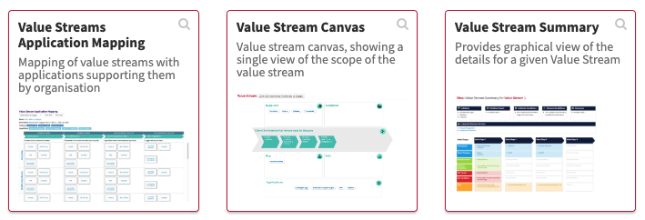
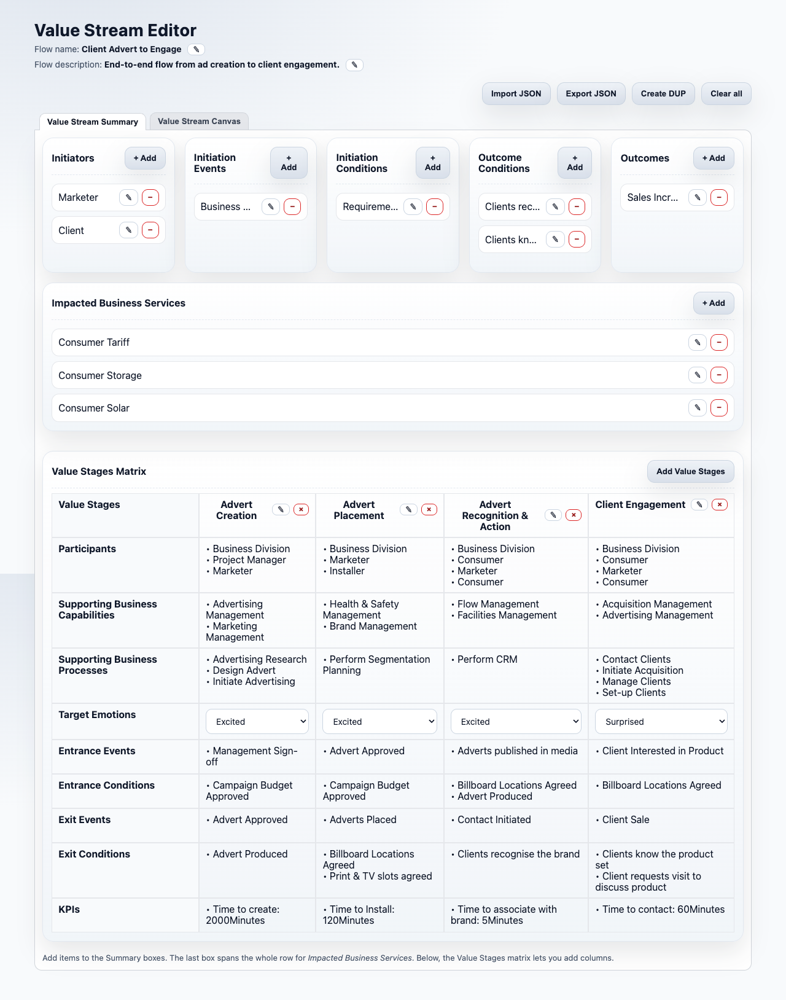
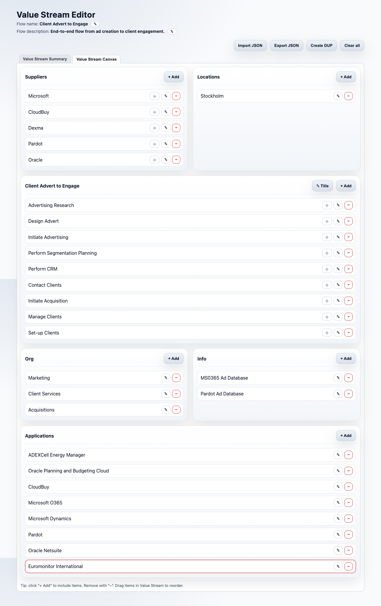

# Essential Open One Page Editor

HTML **standalone** pages acting as simple editors for collecting data for the **Essential Project**. Each editor supports **JSON import/export** and **`.dup` export** compatible with **Essential Open Source**, **Docker**, and **Cloud**.

The single-page approach is intentional: it provides a friendlier, simpler experience than spreadsheets. IT and business users can capture information quickly without dealing with workbook structures or formulas. The data for each Value Stream can be stored temporarily as **JSON** files for later validation by the architecture team and, once approved, exported as a **`.dup`** for import into Essential.

> ⚠️ **No integrity validation**: editors do not check consistency against the Essential repository; items with the same name already registered in Essential will be matched/related during `.dup` import. These single-page editors work directly with the information presented in the views; complementary details can be added later in Essential using **Protégé** (Open Source) or the **web editor** available in the Docker and Cloud versions.

## Status

- ✅ Available editor: **Value Stream Editor** (`editors/value-stream-editor-en-standalone.html`)
- 🧩 Next: additional editors (capabilities, apps, processes, etc.)

## Quick Start

1. Clone the repo.
2. Open `editors/value-stream-editor-en-standalone.html` in a modern browser (Chrome/Edge/Firefox).
3. Fill in the form, then **Export JSON** or **Export .dup**.
4. Import the `.dup` into Essential (Open/Docker/Cloud).

## What It’s For

This project reduces the learning curve for newcomers to Essential’s metamodel by providing a simple UI to capture data. Users (IT or business) can save **JSON** drafts for review by the architecture team and later generate a **`.dup`** for import into Essential.

### Value Stream Editor scope

The Value Stream Editor allows you to capture the information presented in the following Essential views:

- **Value Stream Summary**
- **Value Stream Canvas**
- **Value Streams Application Mapping**

#### Screenshots

## Repository Layout (high level)

- `editors/` — standalone HTML editors  
- `examples/` — sample JSON files  
- `docs/` — guides and documentation  
- `assets/` — screenshots
